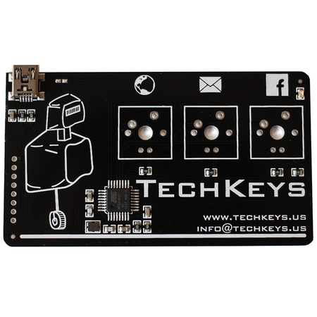

techkeys
========



Various things for the `atmega16u2` based techkeys business card

These source come from [this geekhack thread](http://geekhack.org/index.php?topic=53378.30)

+ The `techkeys_source` is from the creator of the card.
+ The `KeyCard-*` directory contains a completely different implementation (see post #34 of the thread for usage). This contains an AVR studio project which is untested. (I build via avr-gcc)

My goal:
+ Seperate most of the HID protocol to create a simple GUI configurator
+ Learn something about atmega16u2
+ Get a simple version of firmata working


Makefiles
---------
There is a `Makefile` in each project directory. Here is the process:
```
$ make
[CC ]  obj/includes/u_hid_kb.o
[CC ]  obj/includes/u_des_kb.o
[CC ]  obj/main.o
main.c: In function 'main':
<built-in>: warning: function declared 'noreturn' has a 'return' statement
[CC ]  obj/kb.o
[ELF]  bin/KeyCard.elf
[HEX]  bin/KeyCard.hex

$ make flash 
Flashing...
[sudo] password for aclark: 
[+] Waiting for DFU mode (connect device and jump the pads!)    
[+] Erasing...    
[+] Uploading...
```


Manual flash
------------
Generating the `.hex` file is usually as simple as converting the output binary to hex with `avr-objcopy`

```
<compilation here>
$ arv-objcopy -O ihex a.out MYHEX.hex
```

To program the board in linux, you must plug it in, and JUMP the two pins next to the USB port via something metal, then:

```
$ sudo dfu-programmer atmega16u2 erase
$ sudo dfu-programmer atmega16u2 flash MYHEX.hex --debug-level=5
``` 
